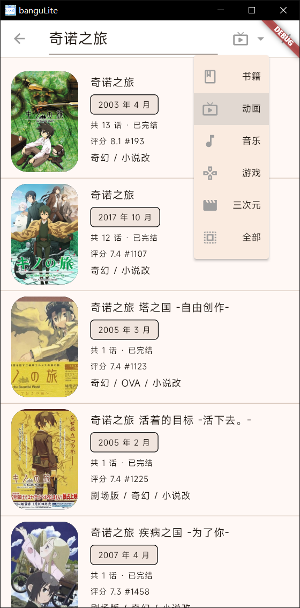

# banguLite

*banguLite —— Lite to surf bangumi*

透过Flutter编写，由MD风格打造的简约bangumi信息浏览客户端。

目前支持Android 与 windows 双端，

在项目release处下载。

> 如果不知道Android端要哪一个就选 arm64 的那个

:heart:  ? :star: : null;

****

### 功能展示

**基础功能**

| 主界面                            | 番剧详情                        | (本地)收藏页面                |
| --------------------------------- | ------------------------------- | ----------------------------- |
|  |  |  |

**社区讯息浏览**

| 小组话题                                                  | 时间线信息                                         | 用户头像信息                |
| --------------------------------------------------------- | -------------------------------------------------- | --------------------------- |
|  |  |  |

**账号操作**(需登录) 

| 添加收藏                                              | 贴条                              | 回复                              |
| ----------------------------------------------------- | --------------------------------- | --------------------------------- |
|  |  |  |

**杂项**

| 深色模式                             | 搜索                                            | 筛选                                            |
| ------------------------------------ | ----------------------------------------------- | ----------------------------------------------- |
|  |  |  |

****

 <b>目前功能如下</b> 

- [x] 番剧页面展示

  - [x] 番剧进度
  - [x] 查看分数投票分布
  - [x] 相关条目
  - [x] 用户的日志查看
  - [x] 讨论板

- [x] 浏览单个番剧的吐槽

  - [x] 浏览番剧中的单集内的吐槽
  - [x] bbcode与表情包贴纸适配
  - [ ] 发布内容

- [x] 主页面

  - [x] 搜索/筛选条件找番

  - [x] 黑暗模式

  - [x] 本地收藏

  - [x] 应用内检查更新

  - [x] 允许应用内大部分bgm内容跳转

TODO(按必要性的优先级排列)

- [ ] 本地的历史浏览记录
- [ ] 适配 BBCode [user] 也就是 @ 的显示

- [ ] 登录账号发布内容: 时间线/小组话题/番剧话题/Blog
- [ ] 本地与账号的番剧收藏同步

****

 <b>作者闲谈</b> 

​    

*做加法比较难 但做减法更难。* 

我自己创建这个项目的定位就是 

**随手打开逛一逛几分钟 然后随手关闭**

于是就萌生了这个项目的念头: 轻松浏览bangumi。

我作为各种意义上的**一言堂** 理应很容易去做割舍。

结果在我真正做起来的时候 却又面临不同讯息API的抉择

这听起来很奇怪 整个项目的信息都只有我一个人去控制。

然而实际上的开发 却是经常"左右脑互博"

特别是在**信息密度很高**的移动端里。

怎么保持信息的不扎堆 又要保持大伙一般会留意的信息是很让我纠结的事

这种纠结甚至有时能超过了 skill issue。。

因为论信息/功能完整度 的 客户端

那些早就有相同定位的客户端 **不仅比我做的早也比我做的好**

****

比较典型的是后期才加入的账号功能

当时构想的时候就直接就把账号功能的优先级排进 **low-level** 了

因为引入账号不仅仅只是登录就完事了

这也同样意味着要额外引入**极多的输入性交互**

- 个人信息管理要吗

- 好友管理要吗

- 通知管理要吗

- 评论/贴条要吗

- 收藏信息同步要做吗

- 剧集进度管理要吗

- 发布帖子要吗

- ...

  

但一想到一个 bangumi 客户端 不支持登录未免又太荒唐。

如果我作为用户见到这个不能登录的客户端怕是只会一头问号

那结果就是硬着头皮上了。

到最后就是 优先展示即使未登录也能访问的内容

至少在表面上来看 几乎看不出登入与不登入之间的差别

对于已登入而言 也仅仅是多了几个可互动的入口/分支。那么这就是我自己保持 lite的答案了...

最后

祝大伙用的舒心 用的..**"满不在乎"**

那么我开发这个app的定位就算达成了

****

#### 致谢

##### API

- [bangumi-server-private](https://github.com/bangumi/server-private)

- [bangumi-api](https://github.com/bangumi/api)

感谢 bgm 官方的数据API 能让我得以去尝试 去做这么一个项目。

