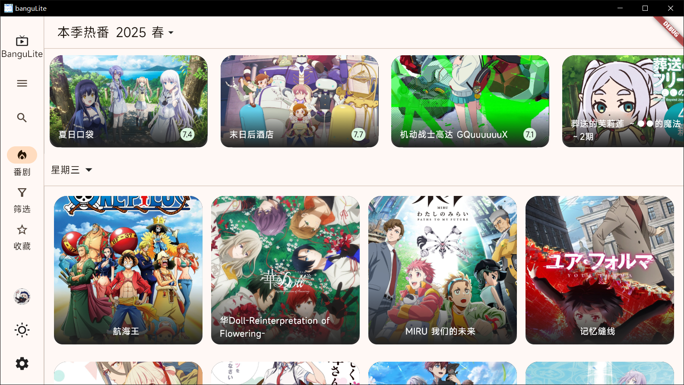
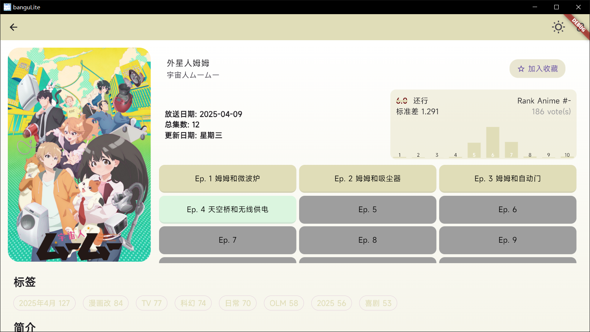
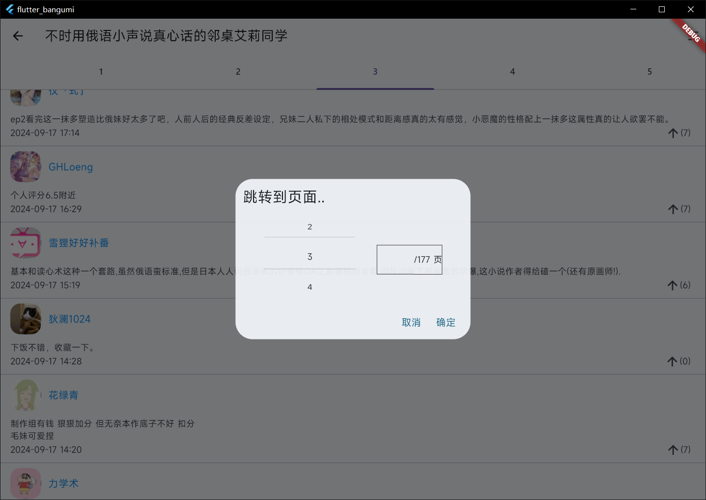
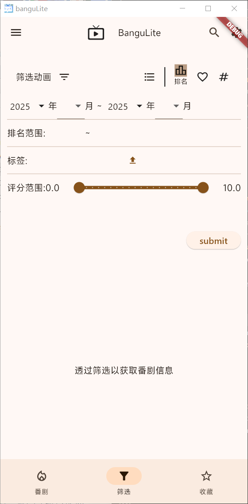
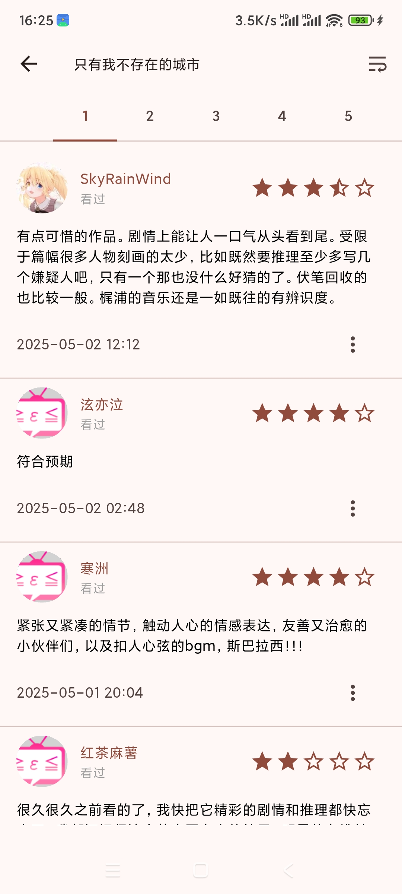

# banguLite

### 功能展示

#### 简约的bangumi信息浏览。

#### 番剧界面详情

#### 吐槽评论界面

搜索&筛选

****

### 移动端界面适配

****

## TODO

待更新内容:

#### [enchantment]

- [x] 本地收藏功能(Hive存储) - 本地订阅页面
- [ ] gridView切换
- [x] 关联浏览器应用打开原始 番剧/评论 网页
- [ ] 单集详情(ep内容)
- [ ] 表情符号转义

#### [UI]

- [x] 番剧详情页面提取番剧主题色作为背景渐变 

  原版的Theme里ImageProvider提取色非常的难用。。 但确实至少是做出来了。
