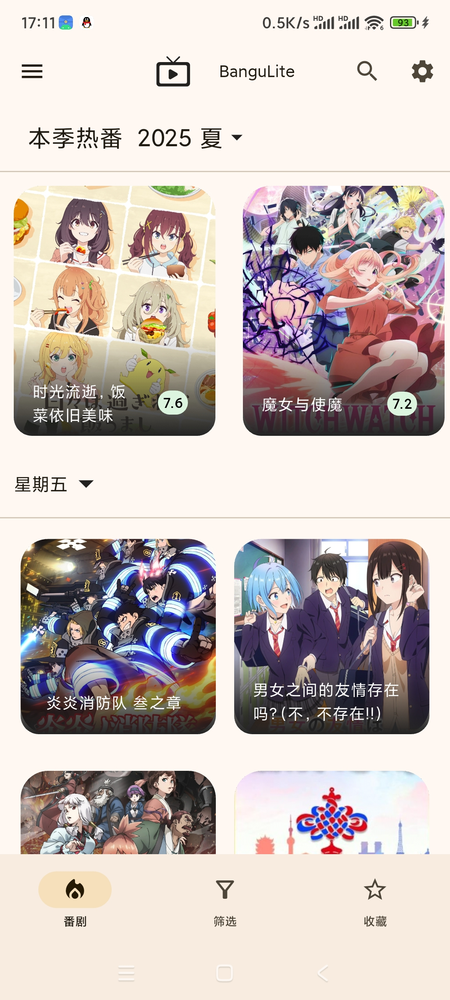

# banguLite

*banguLite —— Lite to surf bangumi*

透过Flutter编写，由MD风格打造的简约bangumi信息浏览客户端。

****

目前功能如下:

- [x] 番剧页面展示
  - [x] 番剧进度
  - [x] 查看分数投票分布
  - [x] 讨论板
- [x] 浏览单个番剧的吐槽
  - [x] 浏览番剧中的单集内的吐槽
  - [x] bbcode与表情包贴纸适配
- [x] 搜索/筛选条件找番

- [x] 黑暗模式

- [x] 本地收藏

- [x] 应用内检查更新

目前支持Android 与 windows 双端，

在项目release处下载。

> 如果不知道Android端要哪一个就选 arm64 的那个

:heart:  ? :star: : null;

****

### 功能展示

#### 番剧界面详情

#### 吐槽评论界面

**搜索&筛选**

**订阅界面**

****

### 移动端界面适配

**黑暗模式**

****

## TODO

#### [enchantment]

- [ ] 基础的国际化
- [ ] 增加Android端的通知(预定为收藏之后每次到更新日期会弹一个通知)

#### [**feature**]

- 其他板块区域

​	

- low-level 账号系统

​	因为如果要引入账号 就意味着要额外引入极多的输入性交互，个人信息管理。

​	以及好友等等的问题 尚不清楚那之后还能不能保持"Lite"之名。

​	目前个人认为最多先把平常web端不登录能访问到什么数据 这里就有什么数据的地步

#### [UI]

设置页

- [x] 主题色调切换

#### [状况通知-LowLevel]

- [ ] 网络检测与对应的组件行为
  - 侦测断网时 直接不予加载 除非网络检测重新更新为网络正常
- [ ] 移动端通知(因为桌面端应该没人会一直挂着app 这只能是适用移动端的行为)

受限于API暂无法完成的部分

- 贴纸表情reaction
- 用户的动态关联到某个番剧处理
